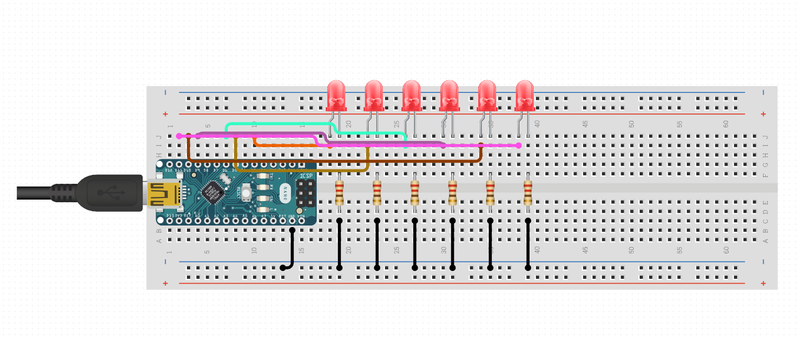

## Summary
This code is a demonstration of encoding seconds into a binary display using LEDs. Each LED represents a binary bit, and the combination of LEDs shows the current time.
- The binary representation is displayed from left to right, with the least significant bit on the leftmost LED.
- The binary digits are printed to the Serial Monitor for debugging purposes.

## Process
Here is the schematic drawing of my circuit.

## Challenge
1. Loop:
   - Gets the current time using `millis()` and checks if the specified time interval (`interval`) has passed since the last update.
   - If the interval has elapsed, it increments the `binaryCounter`, updates the LED display, and resets the counter to 0 when it reaches 60 (for seconds in a minute).
   - Calls the `updateLEDs()` function to display the binary representation on the LEDs.
2. updateLEDs Function:
   - Takes an integer value as an argument (in this case, the `binaryCounter` representing seconds).
   - Converts the decimal value to a six-digit binary number.
   - Updates the state of each LED based on the corresponding bit in the binary representation using `digitalWrite()`.
   - Prints the binary representation to the Serial Monitor for debugging.
